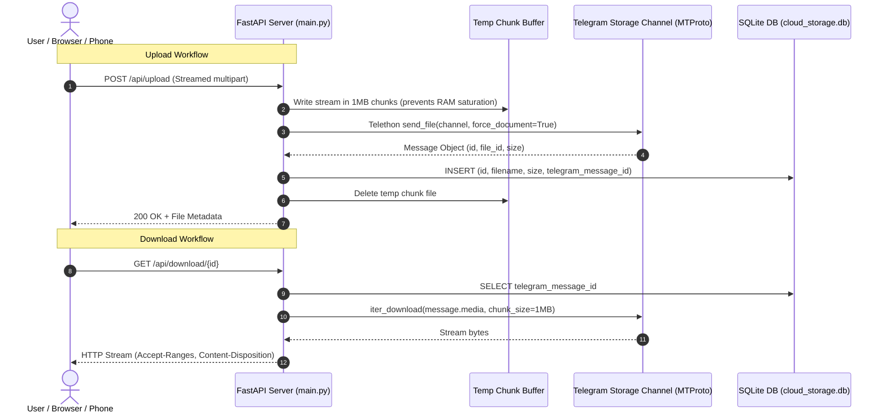

# ☁️ Telegram Cloud Storage Drive: Complete Guide & Documentation

A complete architectural and operational reference for building and hosting an unlimited personal Cloud Storage Drive backed by Telegram MTProto messages with **2 GB per-file uploads**, an SQLite metadata catalog, and 24/7 remote laptop access.

---

## 📑 Table of Contents

1. [Architectural Overview](#1-architectural-overview)
2. [Prerequisites & Useful Links Directory](#2-prerequisites--useful-links-directory)
3. [Step-by-Step Setup Guide](#3-step-by-step-setup-guide)
4. [Core Architecture & Code Snippets](#4-core-architecture--code-snippets)
5. [Hosting 24/7 on Your Laptop & Remote Access](#5-hosting-247-on-your-laptop--remote-access)
6. [Troubleshooting & Common Pitfalls](#6-troubleshooting--common-pitfalls)

---

## 1. Architectural Overview

Traditional Telegram bots communicating over the standard HTTP Bot API (`api.telegram.org`) are capped at **50 MB** per upload. This project circumvents that limitation by using Telegram's native **MTProto protocol** (via `Telethon`), unlocking the full **2 GB per file limit** (or **4 GB** if the account has Telegram Premium).

### Data Flow Diagram



---

## 2. Prerequisites & Useful Links Directory

| Tool / Resource | URL | Purpose |
| :--- | :--- | :--- |
| **Telegram API Portal** | [my.telegram.org](https://my.telegram.org) | Generate your `API_ID` and `API_HASH`. |
| **@BotFather** | [t.me/BotFather](https://t.me/BotFather) | Create your Telegram Bot and get `BOT_TOKEN`. |
| **Telegram Web (A)** | [web.telegram.org/a/](https://web.telegram.org/a/) | Find your Channel ID directly in the browser address bar. |
| **@JsonDumpBot** | [t.me/JsonDumpBot](https://t.me/JsonDumpBot) | Alternative method to get the Channel ID via message forward. |
| **Tailscale** | [tailscale.com](https://tailscale.com) | Free, encrypted remote access from anywhere (no 100MB limit). |
| **Python 3.12+** | [python.org](https://www.python.org/) | Core backend programming language. |

---

## 3. Step-by-Step Setup Guide

### Step 3.1: Clone and Navigate to Project Directory

```powershell
cd C:\Users\12019\.gemini\antigravity\scratch\telegram-cloud-drive
```

Activate the pre-configured virtual environment:
```powershell
.\venv\Scripts\Activate.ps1
```

*(If setting up on a fresh machine, install requirements: `pip install -r requirements.txt`)*

---

### Step 3.2: Obtain Telegram MTProto Credentials

1. Go to **[https://my.telegram.org](https://my.telegram.org)**.
2. Enter your phone number and the confirmation code sent to your Telegram app.
3. Select **API development tools**.
4. Create an application (e.g., App title: `TelegramDrive`, Short name: `tgdrive`).
5. Save your numeric **`App api_id`** (e.g. `28475912`) and **`App api_hash`** string.

---

### Step 3.3: Create Bot via @BotFather

1. Open Telegram and message **[@BotFather](https://t.me/BotFather)**.
2. Send `/newbot`.
3. Give it a Display Name (e.g., `My Storage Bot`) and a Username ending in `bot` (e.g., `my_storage_vault_bot`).
4. Copy the **HTTP API Token** (e.g., `7123456789:AAFx...`).

---

### Step 3.4: Create Private Storage Channel & Get Channel ID

1. In Telegram, create a **New Channel**.
   - Name: `Cloud Storage Vault`
   - Privacy: **Private**
2. In Channel Settings -> **Administrators** -> **Add Administrator**:
   - Add your bot and grant it **Post Messages** and **Delete Messages** permissions.
3. Find your **Channel ID**:
   - Open [web.telegram.org/a/](https://web.telegram.org/a/) in your browser.
   - Click on your channel.
   - Look at the browser URL: `https://web.telegram.org/a/#-1002158934201`
   - Your Channel ID is **`-1002158934201`** (including the `-100` prefix).

---

### Step 3.5: Configure `.env` File

Create `.env` from the template:
```powershell
Copy-Item .env.example .env
notepad .env
```

Set the values:
```env
TELEGRAM_API_ID=28475912
TELEGRAM_API_HASH=your_32_character_api_hash_here
TELEGRAM_BOT_TOKEN=7123456789:AAFx...
TELEGRAM_CHANNEL_ID=-1002158934201

MAX_FILE_SIZE=2147483648
TELEGRAM_SESSION_NAME=telegram_cloud_session
```

---

### Step 3.6: Launch the Application

```powershell
.\venv\Scripts\python -m uvicorn main:app --host 127.0.0.1 --port 8000 --reload
```

Open **[http://127.0.0.1:8000](http://127.0.0.1:8000)** in your browser.

---

## 4. Core Architecture & Code Snippets

### A. Telethon MTProto Client (`telegram_client.py`)
Uploads up to 2 GB documents directly to the channel in MTProto chunks, and provides chunked streaming downloads:

```python
# 2 GB Document Upload via MTProto
message = await self.client.send_file(
    entity=self.channel_entity,
    file=str(file_path),
    caption=f"📁 **File:** `{filename}`\n💾 **Size:** {os.path.getsize(file_path):,} bytes",
    force_document=True,
    attributes=[DocumentAttributeFilename(file_name=filename)],
    progress_callback=progress_callback
)

# Chunked Download Stream (Memory-safe 1 MB chunks)
async def download_file_stream(self, telegram_message_id: int):
    message = await self.client.get_messages(self.channel_entity, ids=telegram_message_id)
    async for chunk in self.client.iter_download(message.media, chunk_size=1024 * 1024):
        yield chunk
```

### B. Memory-Safe Chunked Upload API (`main.py`)
Streams large files directly into a temporary file on disk rather than holding 2 GB in memory:

```python
@app.post("/api/upload")
async def upload_file(file: UploadFile = File(...)):
    temp_path = UPLOAD_DIR / f"upload_{os.urandom(8).hex()}_{file.filename}"
    total_uploaded = 0
    try:
        with open(temp_path, "wb") as buffer:
            while chunk := await file.read(1024 * 1024): # 1 MB chunks
                total_uploaded += len(chunk)
                if total_uploaded > MAX_FILE_SIZE: # 2 GB check
                    raise HTTPException(status_code=413, detail="Exceeds 2 GB limit")
                buffer.write(chunk)

        # Dispatch to Telegram channel as document message
        msg_id, channel_id, tg_file_id = await storage_client.upload_file(temp_path, file.filename)
        
        # Save metadata to database
        return await add_file(file.filename, total_uploaded, file.content_type, msg_id, channel_id, tg_file_id)
    finally:
        if temp_path.exists():
            temp_path.unlink()
```

### C. Streaming Download API (`main.py`)
Streams bytes with standard HTTP range & disposition headers:

```python
@app.get("/api/download/{file_id}")
async def download_file(file_id: str):
    file_record = await get_file(file_id)
    chunk_stream = storage_client.download_file_stream(file_record["telegram_message_id"], file_record["filename"])
    
    quoted_filename = urllib.parse.quote(file_record["filename"])
    headers = {
        "Content-Disposition": f"attachment; filename*=UTF-8''{quoted_filename}",
        "Content-Length": str(file_record["size"]),
        "Accept-Ranges": "bytes"
    }
    return StreamingResponse(chunk_stream, media_type=file_record["mime_type"], headers=headers)
```

---

## 5. Hosting 24/7 on Your Laptop & Remote Access

### Step 5.1: Run with HTTPS (Encrypted SSL)

#### Method A: Native HTTPS via SSL Certificates (Generated inside project)
SSL certificates (`cert.pem` and `key.pem`) have been generated for you. Run:
```powershell
.\venv\Scripts\python -m uvicorn main:app --host 0.0.0.0 --port 8443 --ssl-keyfile key.pem --ssl-certfile cert.pem
```
Access via: **`https://127.0.0.1:8443`** or **`https://<your-ip>:8443`**.

#### Method B: Trusted Let's Encrypt HTTPS via Tailscale (Zero Browser Warnings)
If using Tailscale, run:
```powershell
tailscale serve https / http://127.0.0.1:8000
```
Tailscale automatically provisions a real, trusted **Let's Encrypt SSL certificate** with a green padlock at:
`https://your-laptop-name.your-tailnet.ts.net`

---

### Step 5.2: Remote Access from Anywhere via Tailscale

> [!IMPORTANT]
> **Why Tailscale?** Free tunneling tools like Cloudflare Tunnel enforce a strict **100 MB** request body limit on free plans. Tailscale creates a direct, private WireGuard mesh tunnel between your laptop and your phone/other devices with **no file size limits**, **full transfer speed**, and end-to-end encryption.

1. **Install Tailscale on Laptop**: Download from [tailscale.com](https://tailscale.com) and log in.
2. **Install Tailscale on Phone/Tablet/Other PC**: Log in with the exact same account.
3. Note your laptop's Tailscale name (e.g. `subham-laptop`) or IP (e.g. `100.85.12.34`).
4. **Access Anywhere**: Open `http://subham-laptop:8000` on your phone or remote browser.

---

### Step 5.3: Prevent Windows Laptop from Sleeping with Lid Closed

1. Press `Win + R`, type `powercfg.cpl`, press Enter.
2. Click **"Choose what closing the lid does"** on the left.
3. Set **"When I close the lid"** (Plugged in) to **Do nothing**.
4. Click **"Change when the computer sleeps"** and set **"Put the computer to sleep"** (Plugged in) to **Never**.

---

### Step 5.4: Automatic Startup on Windows Boot

1. Press `Win + R`, type `shell:startup`, press Enter.
2. Create a shortcut with the target:
   ```powershell
   powershell.exe -WindowStyle Hidden -Command "cd C:\Users\12019\.gemini\antigravity\scratch\telegram-cloud-drive; .\venv\Scripts\python -m uvicorn main:app --host 0.0.0.0 --port 8000"
   ```
3. Whenever your laptop starts or reboots, your Telegram Cloud Drive starts silently in the background.

---

## 6. Troubleshooting & Common Pitfalls

### Issue 1: `[WinError 10013]` Access Forbidden to Socket
- **Cause**: Port `8000` is already in use by a background process.
- **Fix**: Identify and kill the process holding port 8000:
  ```powershell
  $id = (Get-NetTCPConnection -LocalPort 8000).OwningProcess
  Stop-Process -Id $id -Force
  ```
  Or change the port in your command: `--port 8080`.

### Issue 2: Forwarding Shows Personal User ID Instead of Channel ID
- **Cause**: Some Telegram bots inspect the user who forwarded the message rather than the original channel.
- **Fix**: Open [web.telegram.org/a/](https://web.telegram.org/a/) in your browser, click your channel, and read the ID from the URL bar (`#-100...`).

### Issue 3: Telegram `FloodWaitError`
- **Cause**: Uploading or downloading dozens of files in rapid succession triggers Telegram's rate-limiting.
- **Fix**: Telethon automatically waits if small rate limits occur; for heavy use, upload files sequentially rather than in parallel.
