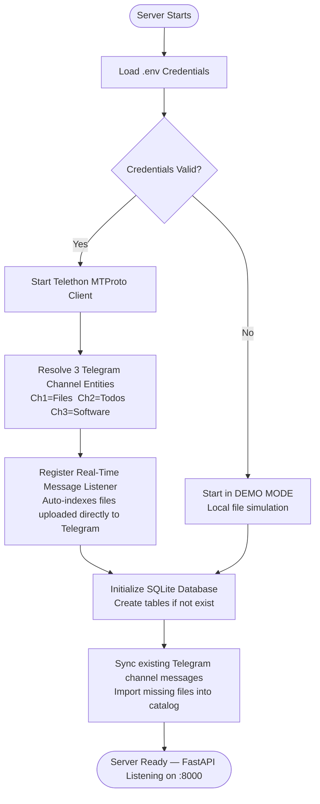
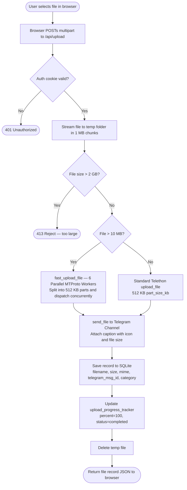
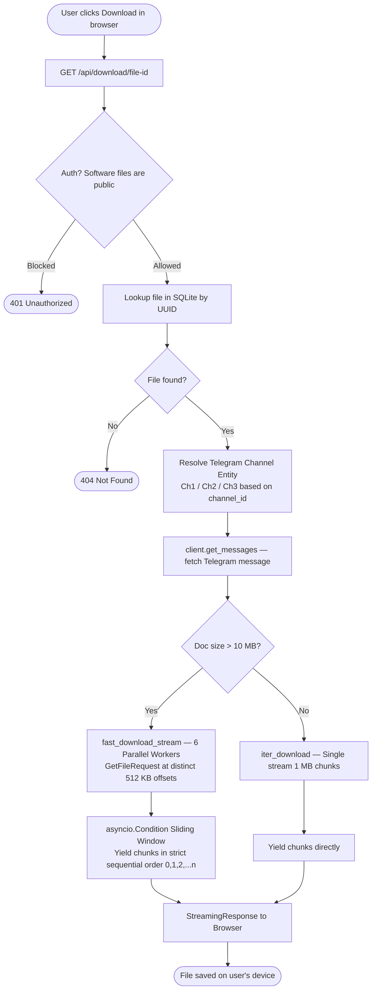
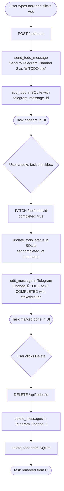
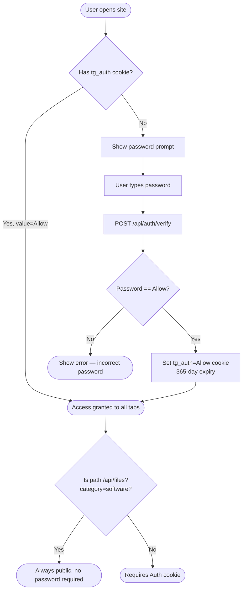
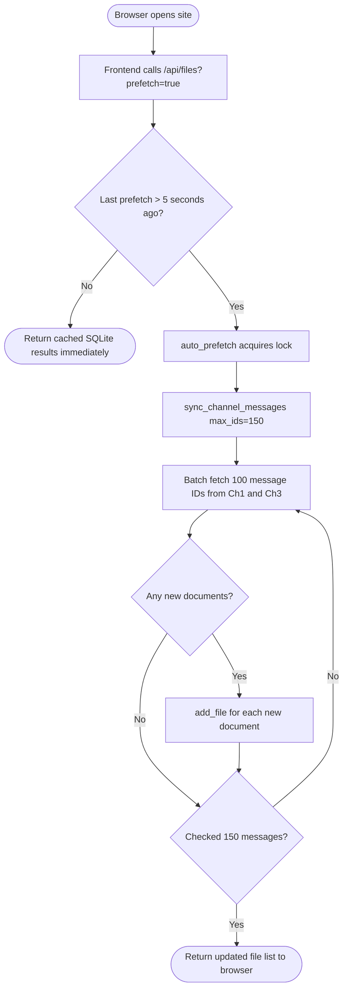

# SS Workspace — Flow Diagrams

---

## 0. Master Flow — All Modules Connected

This single diagram shows how every module in the project connects and interacts end-to-end — from the browser's first request to the final Telegram data center response.

```mermaid
flowchart TD
    %% ─── BROWSER LAYER ───
    subgraph BROWSER["🌐 Browser (index.html)"]
        UI_AUTH["Password Screen\ntg_auth cookie"]
        UI_FILES["Files / Photos / Videos / Software Tabs\nfetchFiles() uploadFile() downloadFile() deleteFile()"]
        UI_TASKS["Tasks Tab\naddTodo() toggleTodo() deleteTodo()"]
        UI_NOTES["Notes Tab\nsaveNote() deleteNote()"]
        UI_PROGRESS["Upload Progress Card\nPolls /api/upload-progress every 500ms"]
    end

    %% ─── FASTAPI LAYER ───
    subgraph FASTAPI["⚙️ FastAPI — main.py"]
        AUTH_MW["auth_middleware\nChecks cookie / header / query token"]
        AUTH_EP["/api/auth/verify\nIssue 365-day cookie"]
        STATUS_EP["/api/status\nHealth + channel info"]
        UPLOAD_EP["/api/upload\nStream → Temp → Telegram → SQLite"]
        PROGRESS_EP["/api/upload-progress/id\nRead progress dict"]
        DOWNLOAD_EP["/api/download/id\nSQLite lookup → StreamingResponse"]
        DELETE_EP["DELETE /api/files/id\nTelegram delete + SQLite delete"]
        TODO_EP["/api/todos CRUD\nCreate / Toggle / Delete / ClearCompleted"]
        NOTE_EP["/api/notes CRUD\nCreate / Delete"]
        PREFETCH_EP["/api/prefetch\nDebounced sync — max once per 5s"]
        SYNC_EP["/api/sync\nForce full channel scan"]
        STATIC["/  and  /favicon.ico\nServe index.html + favicon.svg"]
        PROGRESS_TRACKER["upload_progress_tracker\nIn-memory dict per upload_id"]
    end

    %% ─── CONFIG LAYER ───
    subgraph CONFIG["🔧 config.py"]
        ENV[".env File\nAPI_ID, API_HASH, BOT_TOKEN\nCHANNEL_ID ×3, MAX_FILE_SIZE"]
        IS_CONFIGURED["is_telegram_configured()\nTrue → Live Mode\nFalse → Demo Mode"]
    end

    %% ─── DATABASE LAYER ───
    subgraph DATABASE["🗄️ database.py + SQLite"]
        INIT_DB["init_db()\nCREATE TABLE files, todos, notes"]
        FILES_TABLE["files table\nuuid, name, size, mime, category\ntelegram_msg_id, channel_id"]
        TODOS_TABLE["todos table\nuuid, title, completed\ntelegram_msg_id, completed_at"]
        NOTES_TABLE["notes table\nuuid, content\ntelegram_msg_id"]
        DETECT_CAT["detect_category(filename, mime)\n→ photo / video / software / file"]
        FORMAT_SIZE["format_size(bytes)\n→ 1.50 MB"]
    end

    %% ─── TELEGRAM CLIENT LAYER ───
    subgraph TG_CLIENT["📡 telegram_client.py — TelegramStorageClient"]
        INIT_CLIENT["initialize()\nConnect bot, resolve 3 channels\nRegister real-time listener"]
        SYNC_MSG["sync_channel_messages()\nBatch scan IDs 1-N in Ch1 and Ch3\nImport missing docs into SQLite"]
        FAST_UPLOAD["fast_upload_file()\n6 Workers × 512KB SaveBigFilePartRequest\n3x retry + progress callback"]
        UPLOAD_FILE["upload_file()\nRoute → Ch1 or Ch3\n>10MB → fast_upload_file\n≤10MB → standard upload"]
        FAST_DL["fast_download_stream()\n6 Workers × 512KB GetFileRequest\nasyncio.Condition ordering\nBounded Queue maxsize=12"]
        DL_STREAM["download_file_stream()\nResolve entity → get_messages\n>10MB → fast_download_stream\n≤10MB → iter_download"]
        SEND_TODO["send_todo_message()\n⏳ TODO title → Ch2"]
        UPD_TODO["update_todo_message()\nEdit msg ✅ COMPLETED or ⏳ TODO"]
        SEND_NOTE["send_note_message()\n📝 NOTE content → Ch2"]
        DEL_MSG["delete_message()\ndelete_messages() from correct channel"]
        DEMO_MODE["DEMO MODE\nFallback: local demo_storage/ folder\nNo Telegram connection needed"]
    end

    %% ─── TELEGRAM INFRA ───
    subgraph TELEGRAM["☁️ Telegram MTProto Servers"]
        CH1["Channel 1\nFiles / Photos / Videos"]
        CH2["Channel 2\nTasks + Notes"]
        CH3["Channel 3\nSoftware"]
        TG_DC["Telegram Data Centers\nActual binary storage — Free, Unlimited"]
    end

    %% ─── CONNECTIONS: Browser → FastAPI ───
    UI_AUTH -->|"POST /api/auth/verify"| AUTH_EP
    UI_FILES -->|"GET /api/files"| AUTH_MW
    UI_FILES -->|"POST /api/upload"| AUTH_MW
    UI_FILES -->|"GET /api/download/id"| AUTH_MW
    UI_FILES -->|"DELETE /api/files/id"| AUTH_MW
    UI_TASKS -->|"GET/POST/PATCH/DELETE /api/todos"| AUTH_MW
    UI_NOTES -->|"GET/POST/DELETE /api/notes"| AUTH_MW
    UI_PROGRESS -->|"GET /api/upload-progress/id"| PROGRESS_EP

    %% ─── AUTH MIDDLEWARE ───
    AUTH_MW -->|"Pass if token valid"| UPLOAD_EP & DOWNLOAD_EP & DELETE_EP & TODO_EP & NOTE_EP
    AUTH_MW -->|"Software: always public"| DOWNLOAD_EP

    %% ─── FastAPI → Config ───
    UPLOAD_EP --> CONFIG
    INIT_CLIENT --> CONFIG
    CONFIG --> ENV --> IS_CONFIGURED

    %% ─── FastAPI → Database ───
    UPLOAD_EP -->|"add_file()"| FILES_TABLE
    DOWNLOAD_EP -->|"get_file(uuid)"| FILES_TABLE
    DELETE_EP -->|"delete_file(uuid)"| FILES_TABLE
    TODO_EP -->|"add/get/update/delete todo"| TODOS_TABLE
    NOTE_EP -->|"add/get/delete note"| NOTES_TABLE
    UPLOAD_EP --> DETECT_CAT
    UPLOAD_EP --> FORMAT_SIZE
    INIT_DB --> FILES_TABLE & TODOS_TABLE & NOTES_TABLE

    %% ─── FastAPI → Telegram Client ───
    UPLOAD_EP -->|"upload_file()"| UPLOAD_FILE
    DOWNLOAD_EP -->|"download_file_stream()"| DL_STREAM
    DELETE_EP -->|"delete_message()"| DEL_MSG
    TODO_EP -->|"send/update/delete"| SEND_TODO & UPD_TODO & DEL_MSG
    NOTE_EP -->|"send/delete"| SEND_NOTE & DEL_MSG
    PREFETCH_EP --> SYNC_MSG
    SYNC_EP --> SYNC_MSG

    %% ─── Telegram Client → Upload Path ───
    UPLOAD_FILE -->|"> 10 MB"| FAST_UPLOAD
    UPLOAD_FILE -->|"≤ 10 MB"| CH1
    FAST_UPLOAD -->|"6-worker parallel parts"| CH1
    CH1 --> CH3

    %% ─── Telegram Client → Download Path ───
    DL_STREAM -->|"> 10 MB"| FAST_DL
    DL_STREAM -->|"≤ 10 MB → iter_download"| TG_DC
    FAST_DL -->|"6-worker parallel fetch"| TG_DC

    %% ─── Telegram Client → Productivity ───
    SEND_TODO --> CH2
    UPD_TODO --> CH2
    SEND_NOTE --> CH2
    DEL_MSG --> CH1 & CH2 & CH3

    %% ─── Channels → DC ───
    CH1 & CH2 & CH3 --> TG_DC

    %% ─── Progress Tracker ───
    FAST_UPLOAD -->|"progress_callback"| PROGRESS_TRACKER
    PROGRESS_EP --> PROGRESS_TRACKER

    %% ─── Demo Fallback ───
    IS_CONFIGURED -->|"False"| DEMO_MODE
    UPLOAD_FILE -->|"Demo mode"| DEMO_MODE
    DL_STREAM -->|"Demo mode"| DEMO_MODE

    %% ─── Startup Wiring ───
    INIT_DB --> INIT_CLIENT
    INIT_CLIENT --> SYNC_MSG
```

---

## 1. Application Startup Flow

---

## 2. File Upload Flow

---

## 3. File Download Flow

---

## 4. To-Do Task Flow

---

## 5. Authentication Flow

---

## 6. Channel Sync / Prefetch Flow

