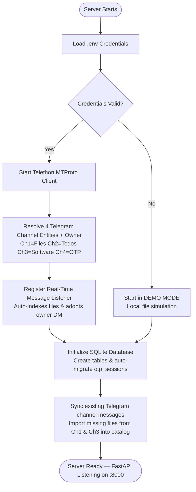
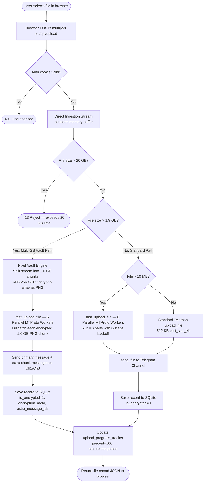
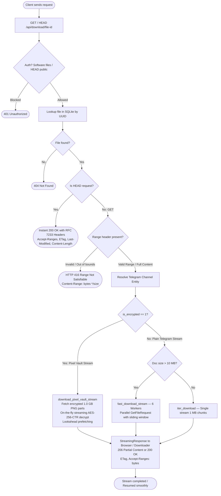
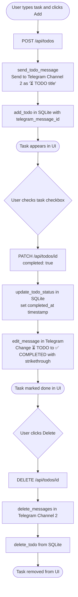
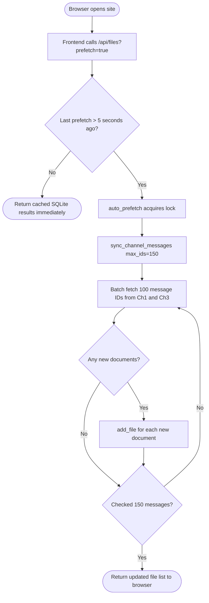

# SS Workspace — Flow Diagrams

---

## 0. Master Flow — All Modules Connected

This single diagram shows how every module in the project connects and interacts end-to-end — from the browser's first request to the final Telegram data center response.

```mermaid
flowchart TD
    %% ─── BROWSER LAYER ───
    subgraph BROWSER["🌐 Browser (index.html)"]
        UI_AUTH["Password Screen\ntg_auth cookie"]
        UI_FILES["Files / Photos / Videos / Software Tabs\nfetchFiles() uploadFile() downloadFile() deleteFile()"]
        UI_TASKS["Tasks Tab\naddTodo() toggleTodo() deleteTodo()"]
        UI_NOTES["Notes Tab\nsaveNote() deleteNote()"]
        UI_PROGRESS["Upload Progress Card\nPolls /api/upload-progress every 500ms"]
    end

    %% ─── FASTAPI LAYER ───
    subgraph FASTAPI["⚙️ FastAPI — main.py"]
        AUTH_MW["auth_middleware\nChecks cookie / header / query token\nHEAD & GET permit software"]
        AUTH_STATUS_EP["/api/auth/status\nLockout status + cross-tab check"]
        AUTH_SEND_EP["/api/auth/send-otp\nRate limit 4/min → Dispatch to Ch4"]
        AUTH_VERIFY_EP["/api/auth/verify-otp\nCheck code + tab match → Set 24h cookie"]
        AUTH_CANCEL_EP["/api/auth/cancel-otp\nCancel session + Purge Telegram message"]
        STATUS_EP["/api/status\nHealth + channel info"]
        UPLOAD_EP["/api/upload\nDirect ingestion stream → 20 GB ceiling\nPixel Vault chunking & Telegram dispatch"]
        PROGRESS_EP["/api/upload-progress/id\nRead dual-track telemetry dict"]
        DOWNLOAD_EP["/api/download/id (GET + HEAD)\nRFC 7233 Range parser + ETag + HTTP 206/416"]
        DELETE_EP["DELETE /api/files/id\nTelegram delete (all chunks) + SQLite delete"]
        TODO_EP["/api/todos CRUD\nCreate / Toggle / Delete / ClearCompleted"]
        NOTE_EP["/api/notes CRUD\nCreate / Delete"]
        PREFETCH_EP["/api/prefetch\nDebounced sync — max once per 5s"]
        SYNC_EP["/api/sync\nForce full channel scan (excludes internal chunks)"]
        STATIC["/  and  /favicon.ico\nServe index.html + favicon.svg"]
        PROGRESS_TRACKER["upload_progress_tracker\nPersistent completion status"]
    end

    %% ─── PIXEL VAULT & TELEMETRY ENGINE ───
    subgraph VAULT["🔒 Pixel Vault & Telemetry"]
        PV_ENGINE["pixel_vault.py\nAES-256-CTR PNG chunking\nStreaming on-the-fly decryption\nZero disk staging"]
        TELEMETRY["telemetry_recorder.py\nDual-track telemetry & RAM tracking\nBounded < 15 MB footprint"]
        SPEED_TRACK["speed_tracker.py\nRolling window throughput & ETA"]
    end

    %% ─── CONFIG LAYER ───
    subgraph CONFIG["🔧 config.py"]
        ENV[".env File\nAPI_ID, API_HASH, BOT_TOKEN\nCHANNEL_ID ×4, OWNER_ID\nMAX_FILE_SIZE = 20 GB"]
        IS_CONFIGURED["is_telegram_configured()\nTrue → Live Mode\nFalse → Demo Mode"]
    end

    %% ─── DATABASE LAYER ───
    subgraph DATABASE["🗄️ database.py + SQLite"]
        INIT_DB["init_db()\nCREATE TABLE files, todos, notes, otp_sessions\nAuto-migrate encryption & extra chunks"]
        FILES_TABLE["files table\nuuid, name, size, mime, category\ntelegram_msg_id, channel_id\nis_encrypted, encryption_meta, extra_message_ids"]
        TODOS_TABLE["todos table\nuuid, title, completed\ntelegram_msg_id, completed_at"]
        NOTES_TABLE["notes table\nuuid, content\ntelegram_msg_id"]
        OTP_TABLE["otp_sessions table\nip, code, expires_at, attempts\ntab, action, target_name, cancelled"]
        DETECT_CAT["detect_category(filename, mime)\nArchives (.zip/.rar/.7z) strictly 'file'"]
        FORMAT_SIZE["format_size(bytes)\n→ 1.50 MB / 4.20 GB"]
    end

    %% ─── TELEGRAM CLIENT LAYER ───
    subgraph TG_CLIENT["📡 telegram_client.py — TelegramStorageClient"]
        INIT_CLIENT["initialize()\nConnect bot, resolve 4 channels + Owner\nRegister real-time listener"]
        SYNC_MSG["sync_channel_messages()\nBatch scan Ch1 & Ch3 (skips [PIXEL_VAULT_CHUNK])\nImport missing docs into SQLite"]
        FAST_UPLOAD["fast_upload_file()\n6 Workers × 512KB SaveBigFilePartRequest\n8-stage backoff + progress callback"]
        UPLOAD_FILE["upload_file()\nRoute → Ch1 or Ch3\n>1.9GB → Pixel Vault (1.0GB chunks)\n>10MB → fast_upload_file\n≤10MB → standard upload"]
        FAST_DL["fast_download_stream()\n6 Workers × 512KB GetFileRequest\nasyncio.Condition sliding window"]
        DL_STREAM["download_file_stream()\nEncrypted → download_pixel_vault_stream\n>10MB → fast_download_stream\n≤10MB → iter_download"]
        PV_STREAM["download_pixel_vault_stream()\nMulti-part MTProto stream\nLookahead prefetch + AES-256-CTR decrypt"]
        SEND_OTP["send_otp_to_owner()\nDispatch OTP to Ch4 / Owner DM\nAuto-delete task 180s"]
        CANCEL_OTP["cancel_active_otp()\nPurge active OTP message from Telegram"]
        SEND_ALERT["send_security_alert()\nOption 3: 5 failures → 10min lock alert"]
        SEND_TODO["send_todo_message()\n⏳ TODO title → Ch2"]
        UPD_TODO["update_todo_message()\nEdit msg ✅ COMPLETED or ⏳ TODO"]
        SEND_NOTE["send_note_message()\n📝 NOTE content → Ch2"]
        DEL_MSG["delete_message()\ndelete_messages() for primary + extra chunk IDs"]
        DEMO_MODE["DEMO MODE\nFallback: local demo_storage/ folder\nNo Telegram connection needed"]
    end

    %% ─── TELEGRAM INFRA ───
    subgraph TELEGRAM["☁️ Telegram MTProto Servers"]
        CH1["Channel 1\nFiles / Photos / Videos / Pixel Vault Chunks"]
        CH2["Channel 2\nTasks + Notes"]
        CH3["Channel 3\nSoftware"]
        CH4["Channel 4\nSecurity & OTP Vault\n3-Min Auto-Purge"]
        TG_DC["Telegram Data Centers\nActual binary storage — Free, Unlimited"]
    end

    %% ─── CONNECTIONS: Browser → FastAPI ───
    UI_AUTH -->|"GET /api/auth/status"| AUTH_STATUS_EP
    UI_AUTH -->|"POST /api/auth/send-otp"| AUTH_SEND_EP
    UI_AUTH -->|"POST /api/auth/verify-otp"| AUTH_VERIFY_EP
    UI_AUTH -->|"POST /api/auth/cancel-otp"| AUTH_CANCEL_EP
    UI_FILES -->|"GET /api/files"| AUTH_MW
    UI_FILES -->|"POST /api/upload"| AUTH_MW
    UI_FILES -->|"GET/HEAD /api/download/id"| AUTH_MW
    UI_FILES -->|"DELETE /api/files/id"| AUTH_MW
    UI_TASKS -->|"GET/POST/PATCH/DELETE /api/todos"| AUTH_MW
    UI_NOTES -->|"GET/POST/DELETE /api/notes"| AUTH_MW
    UI_PROGRESS -->|"GET /api/upload-progress/id"| PROGRESS_EP

    %% ─── AUTH MIDDLEWARE ───
    AUTH_MW -->|"Pass if token valid"| UPLOAD_EP & DOWNLOAD_EP & DELETE_EP & TODO_EP & NOTE_EP
    AUTH_MW -->|"Software / HEAD / GET: public"| DOWNLOAD_EP

    %% ─── FastAPI → Config ───
    UPLOAD_EP --> CONFIG
    INIT_CLIENT --> CONFIG
    CONFIG --> ENV --> IS_CONFIGURED

    %% ─── FastAPI → Database ───
    AUTH_SEND_EP -->|"create_otp_session()"| OTP_TABLE
    AUTH_VERIFY_EP -->|"get_active_otp_session()"| OTP_TABLE
    AUTH_CANCEL_EP -->|"cancel_otp_sessions()"| OTP_TABLE
    UPLOAD_EP -->|"add_file() + encryption meta"| FILES_TABLE
    DOWNLOAD_EP -->|"get_file(uuid)"| FILES_TABLE
    DELETE_EP -->|"delete_file(uuid)"| FILES_TABLE
    TODO_EP -->|"add/get/update/delete todo"| TODOS_TABLE
    NOTE_EP -->|"add/get/delete note"| NOTES_TABLE
    UPLOAD_EP --> DETECT_CAT
    UPLOAD_EP --> FORMAT_SIZE
    INIT_DB --> FILES_TABLE & TODOS_TABLE & NOTES_TABLE & OTP_TABLE

    %% ─── FastAPI → Telegram Client & Pixel Vault ───
    AUTH_SEND_EP -->|"send_otp_to_owner()"| SEND_OTP
    AUTH_CANCEL_EP -->|"cancel_active_otp()"| CANCEL_OTP
    AUTH_VERIFY_EP -->|"send_security_alert() on 5 fails"| SEND_ALERT
    UPLOAD_EP -->|"upload_file()"| UPLOAD_FILE
    UPLOAD_EP --> PV_ENGINE
    UPLOAD_EP --> TELEMETRY
    UPLOAD_EP --> SPEED_TRACK
    DOWNLOAD_EP -->|"download_file_stream()"| DL_STREAM
    DL_STREAM --> PV_STREAM
    PV_STREAM --> PV_ENGINE
    DELETE_EP -->|"delete_message()"| DEL_MSG
    TODO_EP -->|"send/update/delete"| SEND_TODO & UPD_TODO & DEL_MSG
    NOTE_EP -->|"send/delete"| SEND_NOTE & DEL_MSG
    PREFETCH_EP --> SYNC_MSG
    SYNC_EP --> SYNC_MSG

    %% ─── Telegram Client → Upload Path ───
    UPLOAD_FILE -->|"> 1.9 GB"| PV_ENGINE
    PV_ENGINE -->|"1.0 GB AES-256-CTR PNG parts"| FAST_UPLOAD
    UPLOAD_FILE -->|"10 MB - 1.9 GB"| FAST_UPLOAD
    UPLOAD_FILE -->|"≤ 10 MB"| CH1
    FAST_UPLOAD -->|"6-worker parallel parts"| CH1 & CH3

    %% ─── Telegram Client → Download Path ───
    DL_STREAM -->|"is_encrypted == True"| PV_STREAM
    DL_STREAM -->|"> 10 MB plain"| FAST_DL
    DL_STREAM -->|"≤ 10 MB plain"| TG_DC
    PV_STREAM -->|"Streaming AES decryption"| TG_DC
    FAST_DL -->|"6-worker parallel fetch"| TG_DC

    %% ─── Telegram Client → Productivity & Security ───
    SEND_OTP --> CH4
    CANCEL_OTP --> CH4
    SEND_ALERT --> CH4
    SEND_TODO --> CH2
    UPD_TODO --> CH2
    SEND_NOTE --> CH2
    DEL_MSG --> CH1 & CH2 & CH3

    %% ─── Channels → DC ───
    CH1 & CH2 & CH3 & CH4 --> TG_DC

    %% ─── Progress Tracker & Telemetry ───
    FAST_UPLOAD -->|"progress_callback"| TELEMETRY
    TELEMETRY --> SPEED_TRACK --> PROGRESS_TRACKER
    PROGRESS_EP --> PROGRESS_TRACKER

    %% ─── Demo Fallback ───
    IS_CONFIGURED -->|"False"| DEMO_MODE
    UPLOAD_FILE -->|"Demo mode"| DEMO_MODE
    DL_STREAM -->|"Demo mode"| DEMO_MODE

    %% ─── Startup Wiring ───
    INIT_DB --> INIT_CLIENT
    INIT_CLIENT --> SYNC_MSG
```

---

## 1. Application Startup Flow

```mermaid
flowchart TD
    A([Server Starts]) --> B[Load .env Credentials]
    B --> C{Credentials Valid?}
    C -->|Yes| D[Start Telethon MTProto Client]
    C -->|No| E[Start in DEMO MODE\nLocal file simulation]
    D --> F[Resolve 4 Telegram Channel Entities + Owner\nCh1=Files Ch2=Todos Ch3=Software Ch4=OTP]
    F --> G[Register Real-Time Message Listener\nAuto-indexes files & adopts owner DM]
    G --> H[Initialize SQLite Database\nCreate tables & auto-migrate otp_sessions]
    H --> I[Sync existing Telegram channel messages\nImport missing files from Ch1 & Ch3 into catalog]
    I --> J([Server Ready — FastAPI Listening on :8000])
    E --> H
```

---

## 2. File Upload Flow (Direct Ingestion & Pixel Vault Multi-GB)

```mermaid
flowchart TD
    A([User selects file in browser]) --> B[Browser POSTs multipart to /api/upload]
    B --> C{Auth cookie valid?}
    C -->|No| Z([401 Unauthorized])
    C -->|Yes| D[Direct Ingestion Stream<br/>bounded memory buffer]
    D --> E{File size > 20 GB?}
    E -->|Yes| F([413 Reject — exceeds 20 GB limit])
    E -->|No| G{File size > 1.9 GB?}
    G -->|Yes: Multi-GB Vault Path| PV[Pixel Vault Engine<br/>Split stream into 1.0 GB chunks<br/>AES-256-CTR encrypt & wrap as PNG]
    PV --> H1[fast_upload_file — 6 Parallel MTProto Workers<br/>Dispatch each encrypted 1.0 GB PNG chunk]
    H1 --> J1[Send primary message + extra chunk messages to Ch1/Ch3]
    J1 --> K1[Save record to SQLite<br/>is_encrypted=1, encryption_meta, extra_message_ids]
    G -->|No: Standard Path| S{File > 10 MB?}
    S -->|Yes| H2[fast_upload_file — 6 Parallel MTProto Workers<br/>512 KB parts with 8-stage backoff]
    S -->|No| I2[Standard Telethon upload_file<br/>512 KB part_size_kb]
    H2 --> J2[send_file to Telegram Channel]
    I2 --> J2
    J2 --> K2[Save record to SQLite<br/>is_encrypted=0]
    K1 --> L[Update upload_progress_tracker<br/>percent=100, status=completed]
    K2 --> L
    L --> N([Return file record JSON to browser])
```

---

## 3. File Download Flow (RFC 7233 Resumption & Pixel Vault Decryption)

```mermaid
flowchart TD
    A([Client sends request]) --> B[GET / HEAD /api/download/file-id]
    B --> C{Auth? Software files / HEAD public}
    C -->|Blocked| Z([401 Unauthorized])
    C -->|Allowed| D[Lookup file in SQLite by UUID]
    D --> E{File found?}
    E -->|No| F([404 Not Found])
    E -->|Yes| H_CHECK{Is HEAD request?}
    H_CHECK -->|Yes| H_RET([Instant 200 OK with RFC 7233 Headers<br/>Accept-Ranges, ETag, Last-Modified, Content-Length])
    H_CHECK -->|No: GET| RANGE_CHECK{Range header present?}
    RANGE_CHECK -->|Invalid / Out of bounds| R_416([HTTP 416 Range Not Satisfiable<br/>Content-Range: bytes */size])
    RANGE_CHECK -->|Valid Range / Full Content| RESOLVE[Resolve Telegram Channel Entity]
    RESOLVE --> ENC_CHECK{is_encrypted == 1?}
    ENC_CHECK -->|Yes: Pixel Vault Stream| PV_DL[download_pixel_vault_stream<br/>Fetch encrypted 1.0 GB PNG parts<br/>On-the-fly streaming AES-256-CTR decrypt<br/>Lookahead prefetching]
    ENC_CHECK -->|No: Plain Telegram Stream| SIZE_CHECK{Doc size > 10 MB?}
    SIZE_CHECK -->|Yes| FAST_DL[fast_download_stream — 6 Workers<br/>Parallel GetFileRequest with sliding window]
    SIZE_CHECK -->|No| ITER_DL[iter_download — Single stream 1 MB chunks]
    PV_DL --> STREAM[StreamingResponse to Browser / Downloader<br/>206 Partial Content or 200 OK<br/>ETag, Accept-Ranges: bytes]
    FAST_DL --> STREAM
    ITER_DL --> STREAM
    STREAM --> O([Stream completed / Resumed smoothly])
```

---

## 4. To-Do Task Flow

```mermaid
flowchart TD
    A([User types task and clicks Add]) --> B[POST /api/todos]
    B --> C[send_todo_message\nSend to Telegram Channel 2 as '⏳ TODO title']
    C --> D[add_todo in SQLite with telegram_message_id]
    D --> E([Task appears in UI])

    E --> F{User checks task checkbox}
    F --> G[PATCH /api/todos/id\ncompleted: true]
    G --> H[update_todo_status in SQLite\nset completed_at timestamp]
    H --> I[edit_message in Telegram\nChange ⏳ TODO to ✅ COMPLETED with strikethrough]
    I --> J([Task marked done in UI])

    J --> K{User clicks Delete}
    K --> L[DELETE /api/todos/id]
    L --> M[delete_messages in Telegram Channel 2]
    M --> N[delete_todo from SQLite]
    N --> O([Task removed from UI])
```

---

## 5. Authentication Flow (Dynamic Telegram OTP with Option 3 Lockout)

```mermaid
flowchart TD
    A([User opens site]) --> B{Has 24h session cookie?}
    B -->|Yes| C([Full Access Granted])
    B -->|No| D[Display Telegram Security Access Modal]
    D --> E{User switches Tab or closes modal?}
    E -->|Yes| CANCEL[POST /api/auth/cancel-otp\nInvalidate in SQLite & purge from Telegram]
    E -->|No| REQ[Click 'Request Security Code (OTP)']
    REQ --> F[POST /api/auth/send-otp\nBody: tab, action, target_name]
    F --> G{IP locked out?}
    G -->|Yes| H([429 Error — Locked for 10 min])
    G -->|No| I{Rate limit > 4 req/min?}
    I -->|Yes| J([429 Error — Rate limit wait])
    I -->|No| K[Generate 6-digit cryptographic code\nBind to IP, Tab & Action in SQLite]
    K --> L[Dispatch code to Channel 4 Security Vault\nSpecifies Target Tab & Action\nSpawn 3-minute auto-delete task]
    L --> M[Start 60s countdown timer on UI]
    M --> N[User enters 6-digit code in UI]
    N --> O[POST /api/auth/verify-otp\nBody: code, tab, action, target_name]
    O --> P{Code expired > 60s?}
    P -->|Yes| Q([400 Error — Expired, request new OTP])
    P -->|No| TAB_CHECK{Submitted tab == session tab?}
    TAB_CHECK -->|No: Cross-Tab Attempt| CROSS[Reject 400 Bad Request\nCancel session & purge Telegram msg]
    TAB_CHECK -->|Yes| R{Code hash matches SQLite?}
    R -->|Yes| S[Set 24h session cookie\nInvalidate OTP session]
    S --> C
    R -->|No| T[Increment failed attempt counter]
    T --> U{Attempts >= 5?}
    U -->|No| V([Display remaining attempts\ne.g. 3 of 5 left])
    U -->|Yes: Option 3 Triggered| W[Dispatch Security Alert to Channel 4\nLockout IP for 10 minutes]
    W --> X([Display 10-Minute Lockout Countdown])
```

---

## 6. Channel Sync / Prefetch Flow

```mermaid
flowchart TD
    A([Browser opens site]) --> B[Frontend calls /api/files?prefetch=true]
    B --> C{Last prefetch > 5 seconds ago?}
    C -->|No| D([Return cached SQLite results immediately])
    C -->|Yes| E[auto_prefetch acquires lock]
    E --> F[sync_channel_messages max_ids=150]
    F --> G[Batch fetch 100 message IDs from Ch1 and Ch3]
    G --> H{Any new documents?}
    H -->|Yes| I[add_file for each new document]
    H -->|No| J{Checked 150 messages?}
    I --> J
    J -->|No| G
    J -->|Yes| K([Return updated file list to browser])
```
