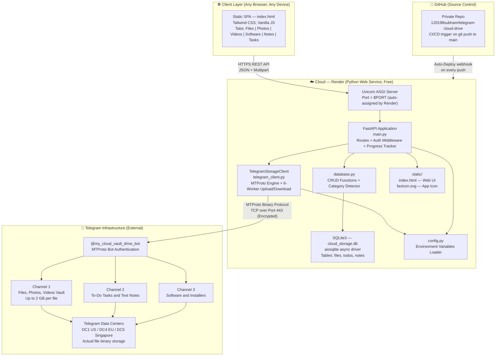
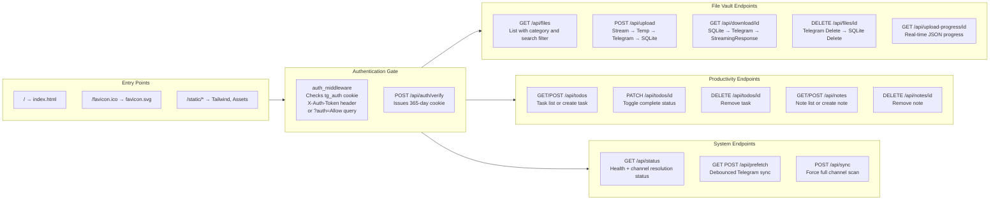
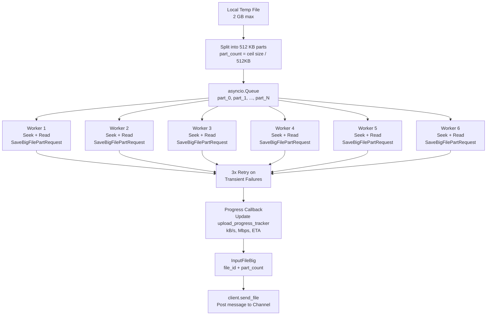
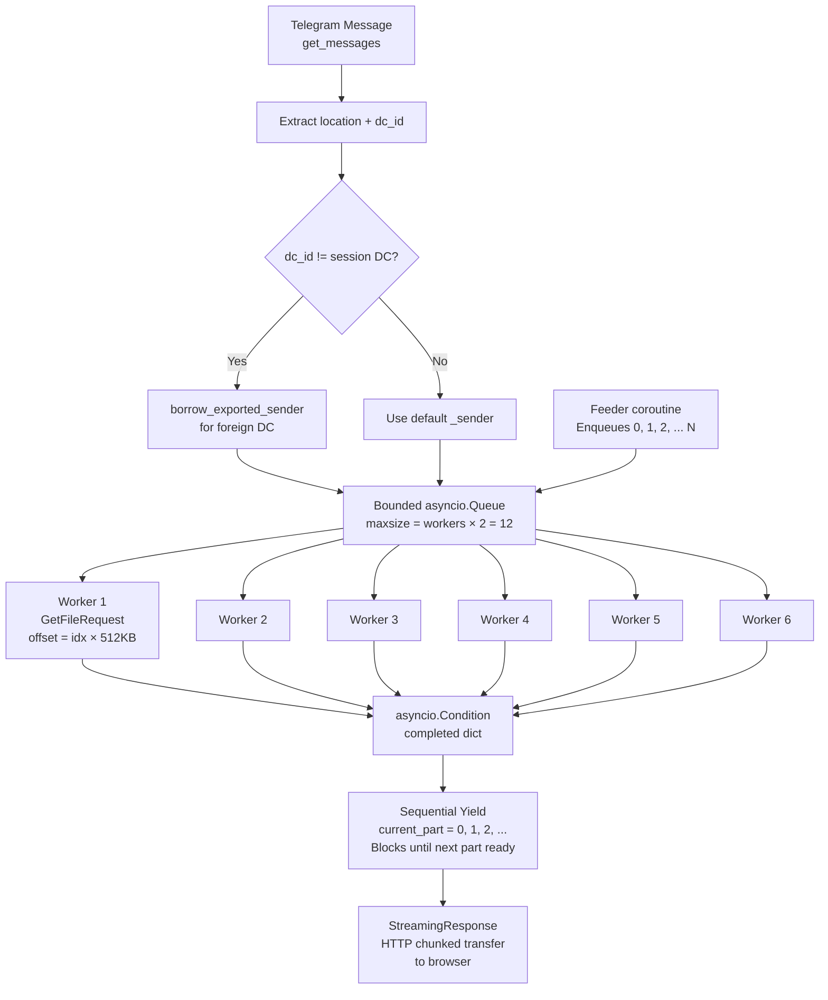

# SS Workspace — Architecture Diagram

---

## Full System Architecture

---

## Component Responsibility Map

---

## MTProto Upload Architecture (6-Worker Pool)

---

## MTProto Download Architecture (6-Worker Sliding Window)

