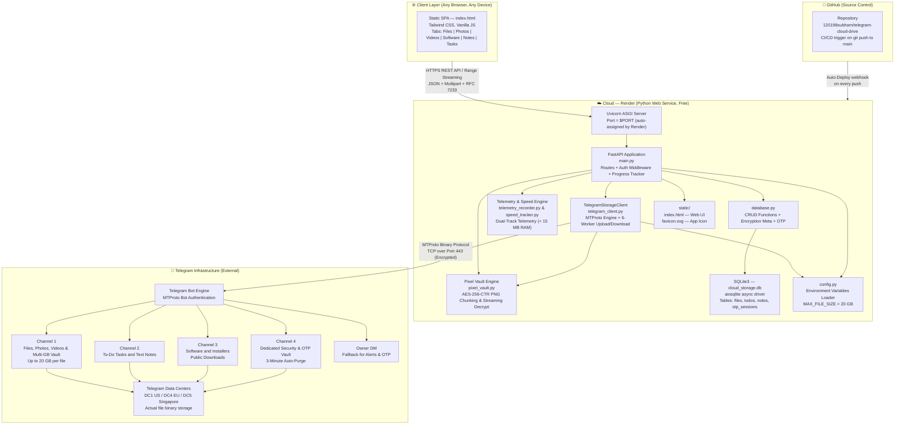
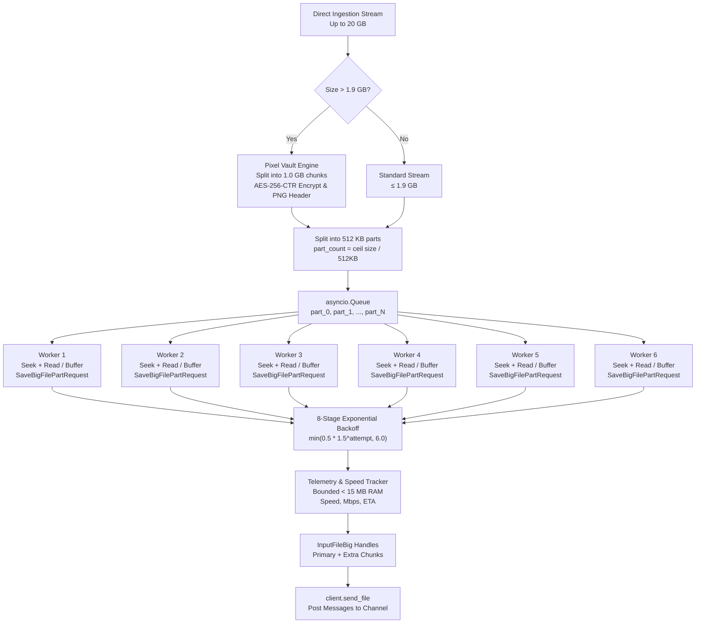
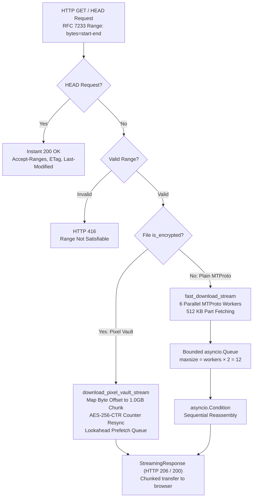

# SS Workspace — Architecture Diagram

---

## Full System Architecture

```mermaid
graph TB
    subgraph CLIENT["🌐 Client Layer (Any Browser, Any Device)"]
        UI["Static SPA — index.html\nTailwind CSS, Vanilla JS\nTabs: Files | Photos | Videos | Software | Notes | Tasks"]
    end

    subgraph RENDER["☁️ Cloud — Render (Python Web Service, Free)"]
        UVICORN["Uvicorn ASGI Server\nPort = $PORT (auto-assigned by Render)"]
        FASTAPI["FastAPI Application\nmain.py\nRoutes + Auth Middleware + Progress Tracker"]
        TG_CLIENT["TelegramStorageClient\ntelegram_client.py\nMTProto Engine + 6-Worker Upload/Download"]
        PIXEL_VAULT["Pixel Vault Engine\npixel_vault.py\nAES-256-CTR PNG Chunking & Streaming Decrypt"]
        TELEMETRY["Telemetry & Speed Engine\ntelemetry_recorder.py & speed_tracker.py\nDual-Track Telemetry (< 15 MB RAM)"]
        DB["SQLite3 — cloud_storage.db\naiosqlite async driver\nTables: files, todos, notes, otp_sessions"]
        CONFIG["config.py\nEnvironment Variables Loader\nMAX_FILE_SIZE = 20 GB"]
        DATABASE["database.py\nCRUD Functions + Encryption Meta + OTP"]
        STATIC["static/\nindex.html — Web UI\nfavicon.svg — App Icon"]
    end

    subgraph TELEGRAM["📡 Telegram Infrastructure (External)"]
        CH1["Channel 1\nFiles, Photos, Videos & Multi-GB Vault\nUp to 20 GB per file"]
        CH2["Channel 2\nTo-Do Tasks and Text Notes"]
        CH3["Channel 3\nSoftware and Installers\nPublic Downloads"]
        CH4["Channel 4\nDedicated Security & OTP Vault\n3-Minute Auto-Purge"]
        OWNER["Owner DM\nFallback for Alerts & OTP"]
        BOT["Telegram Bot Engine\nMTProto Bot Authentication"]
        DC["Telegram Data Centers\nDC1 US / DC4 EU / DC5 Singapore\nActual file binary storage"]
    end

    subgraph GITHUB["🐙 GitHub (Source Control)"]
        REPO["Repository\n120198subham/telegram-cloud-drive\nCI/CD trigger on git push to main"]
    end

    CLIENT -->|"HTTPS REST API / Range Streaming\nJSON + Multipart + RFC 7233"| UVICORN
    UVICORN --> FASTAPI
    FASTAPI --> TG_CLIENT
    FASTAPI --> PIXEL_VAULT
    FASTAPI --> TELEMETRY
    FASTAPI --> DATABASE
    DATABASE --> DB
    TG_CLIENT --> PIXEL_VAULT
    TG_CLIENT --> CONFIG
    FASTAPI --> CONFIG
    FASTAPI --> STATIC
    TG_CLIENT -->|"MTProto Binary Protocol\nTCP over Port 443 (Encrypted)"| BOT
    BOT --> CH1
    BOT --> CH2
    BOT --> CH3
    BOT --> CH4
    BOT --> OWNER
    CH1 --> DC
    CH2 --> DC
    CH3 --> DC
    CH4 --> DC
    GITHUB -->|"Auto-Deploy webhook\non every push"| RENDER
```

---

## Component Responsibility Map

```mermaid
graph LR
    subgraph ENTRY["Entry Points"]
        A["/ → index.html"]
        B["/favicon.ico → favicon.svg"]
        C["/static/* → Tailwind, Assets"]
    end

    subgraph AUTH["Authentication & Security Gate"]
        D["auth_middleware\nEnforces tg_auth cookie\nor bypasses for Software"]
        E1["GET /api/auth/status\nSession & Lockout Telemetry"]
        E2["POST /api/auth/send-otp\nDispatches OTP to Ch4"]
        E3["POST /api/auth/verify-otp\nValidates OTP + Tab & Sets 24h Cookie"]
        E4["POST /api/auth/cancel-otp\nInvalidates & Purges from Telegram"]
    end

    subgraph FILES["File Vault Endpoints"]
        F["GET /api/files\nList with category and search filter"]
        G["POST /api/upload\nStream → Temp → Telegram → SQLite"]
        H["GET /api/download/id\nSQLite → Telegram → StreamingResponse"]
        I["DELETE /api/files/id\nTelegram Delete → SQLite Delete"]
        J["GET /api/upload-progress/id\nReal-time JSON progress"]
    end

    subgraph PRODUCTIVITY["Productivity Endpoints"]
        K["GET/POST /api/todos\nTask list or create task"]
        L["PATCH /api/todos/id\nToggle complete status"]
        M["DELETE /api/todos/id\nRemove task"]
        N["GET/POST /api/notes\nNote list or create note"]
        O["DELETE /api/notes/id\nRemove note"]
    end

    subgraph SYSTEM["System Endpoints"]
        P["GET /api/status\nHealth + channel resolution status"]
        Q["GET POST /api/prefetch\nDebounced Telegram sync"]
        R["POST /api/sync\nForce full channel scan"]
    end

    ENTRY --> AUTH
    AUTH --> FILES
    AUTH --> PRODUCTIVITY
    AUTH --> SYSTEM
```

---

## MTProto Upload Architecture (Pixel Vault Multi-GB & 6-Worker Pool)

```mermaid
graph TD
    FILE["Direct Ingestion Stream\nUp to 20 GB"]
    SIZE_EVAL{"Size > 1.9 GB?"}
    PV_SPLIT["Pixel Vault Engine\nSplit into 1.0 GB chunks\nAES-256-CTR Encrypt & PNG Header"]
    STD_FILE["Standard Stream\n≤ 1.9 GB"]
    SPLIT["Split into 512 KB parts\npart_count = ceil size / 512KB"]
    QUEUE["asyncio.Queue\npart_0, part_1, ..., part_N"]
    W1["Worker 1\nSeek + Read / Buffer\nSaveBigFilePartRequest"]
    W2["Worker 2\nSeek + Read / Buffer\nSaveBigFilePartRequest"]
    W3["Worker 3\nSeek + Read / Buffer\nSaveBigFilePartRequest"]
    W4["Worker 4\nSeek + Read / Buffer\nSaveBigFilePartRequest"]
    W5["Worker 5\nSeek + Read / Buffer\nSaveBigFilePartRequest"]
    W6["Worker 6\nSeek + Read / Buffer\nSaveBigFilePartRequest"]
    BACKOFF["8-Stage Exponential Backoff\nmin(0.5 * 1.5^attempt, 6.0)"]
    TELEMETRY["Telemetry & Speed Tracker\nBounded < 15 MB RAM\nSpeed, Mbps, ETA"]
    RESULT["InputFileBig Handles\nPrimary + Extra Chunks"]
    SENDFILE["client.send_file\nPost Messages to Channel"]

    FILE --> SIZE_EVAL
    SIZE_EVAL -->|Yes| PV_SPLIT --> SPLIT
    SIZE_EVAL -->|No| STD_FILE --> SPLIT
    SPLIT --> QUEUE
    QUEUE --> W1 & W2 & W3 & W4 & W5 & W6
    W1 & W2 & W3 & W4 & W5 & W6 --> BACKOFF --> TELEMETRY
    TELEMETRY --> RESULT --> SENDFILE
```

---

## MTProto Download Architecture (RFC 7233 Resumption & Decryption Stream)

```mermaid
graph TD
    REQ["HTTP GET / HEAD Request\nRFC 7233 Range: bytes=start-end"]
    HEAD_CHECK{"HEAD Request?"}
    HEAD_RESP["Instant 200 OK\nAccept-Ranges, ETag, Last-Modified"]
    RANGE_CHECK{"Valid Range?"}
    ERR_416["HTTP 416\nRange Not Satisfiable"]
    ENC_CHECK{"File is_encrypted?"}
    PV_ENGINE["download_pixel_vault_stream\nMap Byte Offset to 1.0GB Chunk\nAES-256-CTR Counter Resync\nLookahead Prefetch Queue"]
    STD_ENGINE["fast_download_stream\n6 Parallel MTProto Workers\n512 KB Part Fetching"]
    QUEUE["Bounded asyncio.Queue\nmaxsize = workers × 2 = 12"]
    COND["asyncio.Condition\nSequential Reassembly"]
    STREAM["StreamingResponse (HTTP 206 / 200)\nChunked transfer to browser"]

    REQ --> HEAD_CHECK
    HEAD_CHECK -->|Yes| HEAD_RESP
    HEAD_CHECK -->|No| RANGE_CHECK
    RANGE_CHECK -->|Invalid| ERR_416
    RANGE_CHECK -->|Valid| ENC_CHECK
    ENC_CHECK -->|Yes: Pixel Vault| PV_ENGINE --> STREAM
    ENC_CHECK -->|No: Plain MTProto| STD_ENGINE
    STD_ENGINE --> QUEUE --> COND --> STREAM
```
