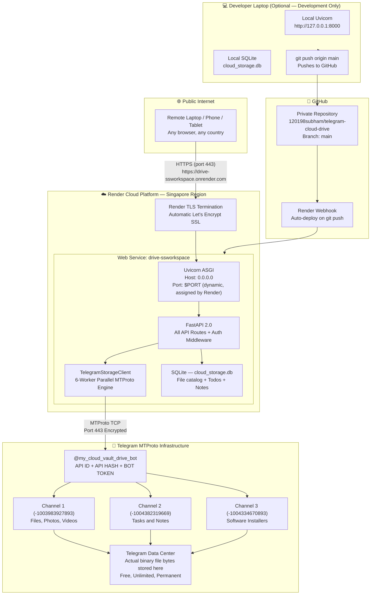
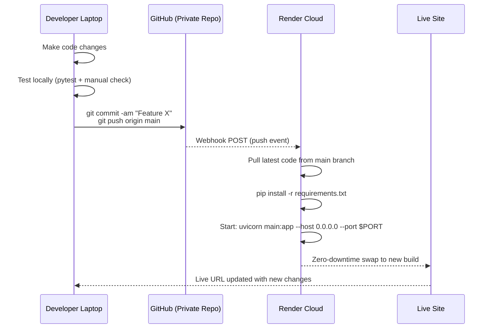
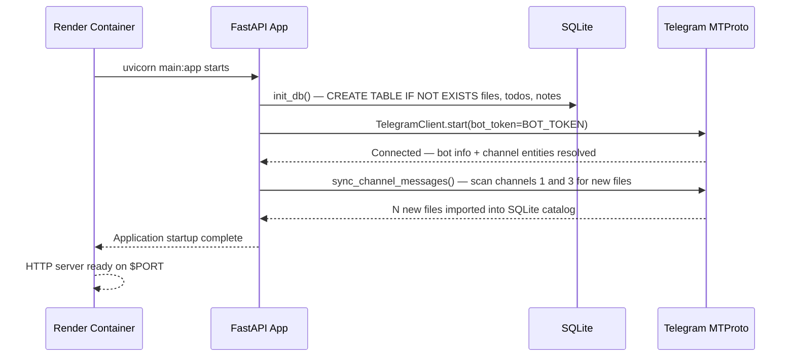
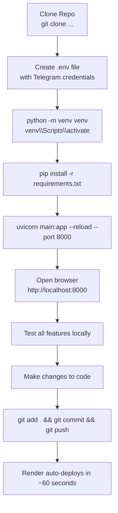

# SS Workspace — Deployment Diagram

---

## Current Production Deployment

---

## CI/CD Pipeline (Continuous Deployment)

---

## Environment Variables Required on Render

| Variable | Example Value | Where to Get |
| :--- | :--- | :--- |
| `TELEGRAM_API_ID` | `36759229` | [my.telegram.org](https://my.telegram.org) → API Development Tools |
| `TELEGRAM_API_HASH` | `1762c8b8...` | Same as above |
| `TELEGRAM_BOT_TOKEN` | `8876019799:AAH...` | [@BotFather](https://t.me/botfather) on Telegram |
| `TELEGRAM_CHANNEL_ID` | `-1003983927893` | Forward a message to @JsonDumpBot |
| `TELEGRAM_TODO_CHANNEL_ID` | `-1004382319669` | Same method as above |
| `TELEGRAM_SOFTWARE_CHANNEL_ID` | `-1004334670893` | Same method as above |
| `MAX_FILE_SIZE` | `2147483648` | 2 GB limit (fixed) |
| `TELEGRAM_SESSION_NAME` | `telegram_cloud_session` | Used as session filename prefix |

---

## Startup Sequence on Render

---

## Local Development Deployment

---

## Combined Module Sequence — Full System Flow

This single sequence diagram traces every module's role from server boot to a complete user session: auth → upload → download → todo → note → sync → shutdown.

```mermaid
sequenceDiagram
    autonumber
    participant USER as Browser index.html
    participant MW   as auth_middleware main.py
    participant API  as FastAPI Routes main.py
    participant CFG  as config.py
    participant DB   as database.py and SQLite
    participant TGC  as TelegramStorageClient telegram_client.py
    participant TG   as Telegram MTProto Channels and DCs

    rect rgb(230, 240, 255)
        Note over API,TGC: SERVER STARTUP
        API->>CFG: load_dotenv() — read .env credentials
        CFG-->>API: API_ID, API_HASH, BOT_TOKEN, CHANNEL_IDs
        API->>DB: init_db() — CREATE TABLE files, todos, notes
        DB-->>API: Tables ready
        API->>TGC: storage_client.initialize()
        TGC->>CFG: is_telegram_configured()?
        CFG-->>TGC: True — Live Mode
        TGC->>TG: TelegramClient.start(bot_token)
        TG-->>TGC: Connected, 3 channel entities resolved
        TGC->>TG: sync_channel_messages() — batch fetch IDs from Ch1 and Ch3
        TG-->>TGC: Existing document messages
        TGC->>DB: add_file() for each doc not already in catalog
        DB-->>TGC: N files imported
        TGC-->>API: Startup complete — server ready
    end

    rect rgb(230, 255, 230)
        Note over USER,API: AUTHENTICATION
        USER->>API: GET / — open site
        API-->>USER: Serve index.html and favicon.svg from static/
        USER->>MW: POST /api/auth/verify — password Allow
        MW-->>API: Public endpoint — bypass auth check
        API-->>USER: Set-Cookie tg_auth=Allow 365 days — success
    end

    rect rgb(255, 245, 220)
        Note over USER,TG: FILE UPLOAD — file larger than 10 MB
        USER->>MW: POST /api/upload multipart upload_id=abc123
        MW->>MW: tg_auth cookie equals Allow — PASS
        MW->>API: Forward request
        API->>API: Stream to uploads_temp/ in 1 MB chunks
        API->>DB: detect_category(filename, mime)
        DB-->>API: category = video
        API->>TGC: upload_file(temp_path, filename, category=video)
        TGC->>TGC: file_size > 10 MB — use fast_upload_file() 6 workers
        loop 6 Parallel MTProto Workers
            TGC->>TG: SaveBigFilePartRequest(file_id, part_N, 512KB bytes)
            TG-->>TGC: Part confirmed True
            TGC->>API: progress_callback(current_bytes, total_bytes)
            API->>API: upload_progress_tracker[abc123] updated
        end
        USER->>API: GET /api/upload-progress/abc123 every 500ms
        API-->>USER: percent 68 speed 12.4 MBs eta 18 seconds
        TGC->>TG: send_file(Channel1, InputFileBig, caption)
        TG-->>TGC: message_id=1042, document_id=ABC
        TGC-->>API: tuple 1042, channel_id, ABC
        API->>DB: add_file(filename, size, mime, msg_id=1042, cat=video)
        DB-->>API: file record with uuid-xyz
        API->>API: Delete temp file from uploads_temp/
        API->>API: progress_tracker[abc123] = completed 100%
        API-->>USER: 200 OK — file record JSON
    end

    rect rgb(245, 230, 255)
        Note over USER,TG: FILE DOWNLOAD — file larger than 10 MB
        USER->>MW: GET /api/download/uuid-xyz
        MW->>MW: tg_auth cookie equals Allow — PASS
        MW->>API: Forward request
        API->>DB: get_file(uuid-xyz)
        DB-->>API: telegram_message_id=1042, channel_id, size=950MB
        API->>TGC: download_file_stream(msg_id=1042, filename, channel_id)
        TGC->>TG: get_messages(Channel1, ids=[1042])
        TG-->>TGC: Message object with document media 950MB
        TGC->>TGC: doc_size > 10MB — fast_download_stream() 6 workers
        TGC->>TGC: Extract location and dc_id from media info
        TGC->>TG: borrow_exported_sender(dc_id) if different DC
        loop 6 Parallel Workers with Bounded Queue maxsize=12
            TGC->>TG: GetFileRequest(location, offset=N times 512KB, limit=512KB)
            TG-->>TGC: Bytes chunk at offset N
            TGC->>TGC: completed[N] = chunk via asyncio.Condition
        end
        TGC->>TGC: Yield chunks in strict sequential order 0 then 1 then 2
        TGC-->>API: AsyncGenerator of byte chunks
        API-->>USER: StreamingResponse — Content-Disposition attachment — browser saves file
    end

    rect rgb(255, 230, 230)
        Note over USER,TG: TO-DO TASK — Create, Toggle, Delete
        USER->>MW: POST /api/todos — title Review PR
        MW->>API: Forward
        API->>TGC: send_todo_message("Review PR")
        TGC->>TG: send_message(Channel2, "pending TODO Review PR")
        TG-->>TGC: message_id=2011
        TGC-->>API: 2011, todo_channel_id
        API->>DB: add_todo(title=Review PR, msg_id=2011)
        DB-->>API: uuid-t1, completed=false
        API-->>USER: Todo object

        USER->>MW: PATCH /api/todos/uuid-t1 — completed true
        MW->>API: Forward
        API->>DB: update_todo_status(uuid-t1, True)
        DB-->>API: Record with completed_at timestamp
        API->>TGC: update_todo_message(2011, "Review PR", completed=True)
        TGC->>TG: edit_message(Channel2, 2011, "COMPLETED strikethrough Review PR")
        API-->>USER: Updated todo object

        USER->>MW: DELETE /api/todos/uuid-t1
        MW->>API: Forward
        API->>TGC: delete_message(todo_channel_id, 2011)
        TGC->>TG: delete_messages(Channel2, [2011])
        API->>DB: delete_todo(uuid-t1)
        API-->>USER: success true
    end

    rect rgb(230, 255, 250)
        Note over USER,TG: TEXT NOTE — Create and Delete
        USER->>MW: POST /api/notes — content Meeting at 3pm
        MW->>API: Forward
        API->>TGC: send_note_message("Meeting at 3pm")
        TGC->>TG: send_message(Channel2, "NOTE Meeting at 3pm")
        TG-->>TGC: message_id=2099
        TGC-->>API: 2099, todo_channel_id
        API->>DB: add_note(content, msg_id=2099)
        API-->>USER: Note object uuid-n1

        USER->>MW: DELETE /api/notes/uuid-n1
        MW->>API: Forward
        API->>DB: delete_note(uuid-n1) — returns note record with msg_id
        API->>TGC: delete_message(channel_id, 2099)
        TGC->>TG: delete_messages(Channel2, [2099])
        API-->>USER: success true
    end

    rect rgb(240, 240, 240)
        Note over USER,TG: PREFETCH AND SYNC — discover new files
        USER->>API: GET /api/files?prefetch=true
        API->>API: auto_prefetch() — check 5 second debounce
        API->>TGC: sync_channel_messages(max_ids=150)
        TGC->>TG: Batch get_messages(Channel1, ids=1 to 100)
        TG-->>TGC: Document messages
        TGC->>DB: add_file() for each doc not in catalog
        TGC->>TG: Batch get_messages(Channel3, ids=1 to 100)
        TG-->>TGC: Software documents
        TGC->>DB: add_file(category=software) for new docs
        TGC-->>API: N new files imported
        API->>DB: get_files()
        DB-->>API: Complete file list
        API-->>USER: files array with count
    end

    rect rgb(255, 240, 240)
        Note over API,TGC: SERVER SHUTDOWN
        API->>TGC: storage_client.close()
        TGC->>TG: client.disconnect()
        TG-->>TGC: Disconnected
        TGC-->>API: Closed
    end
```

