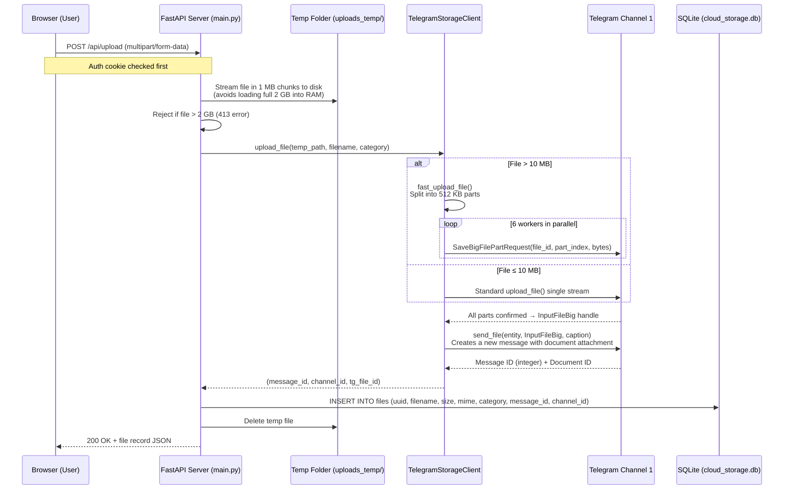
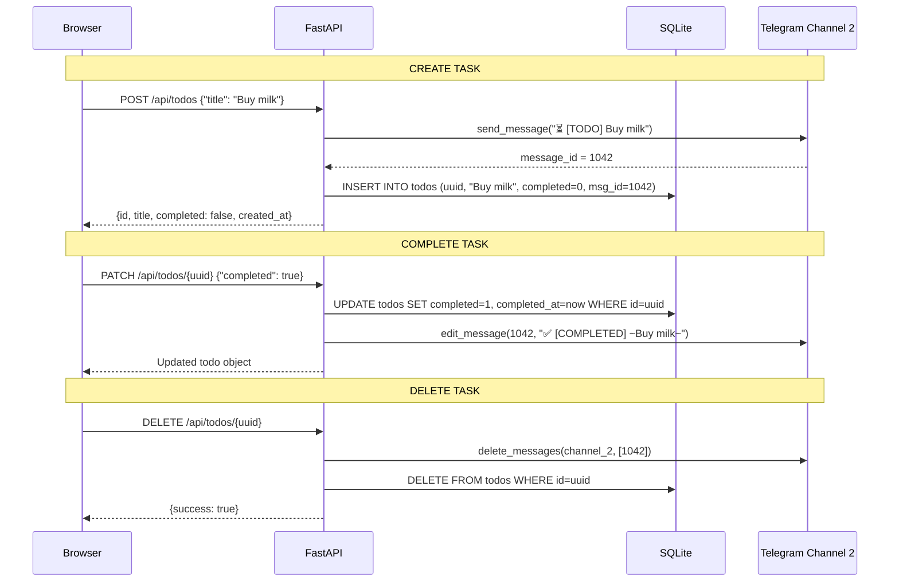
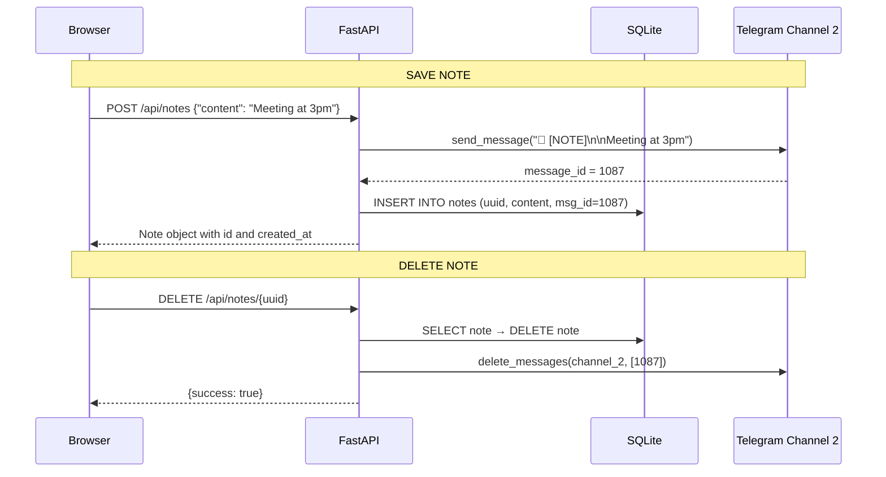
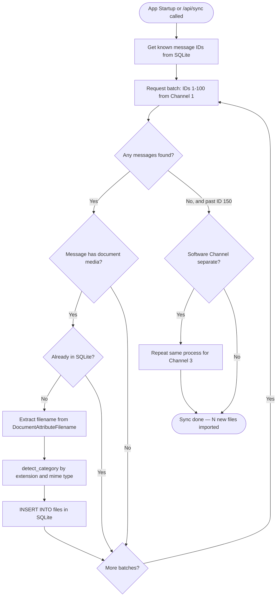
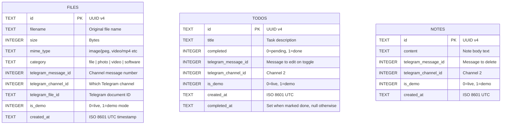
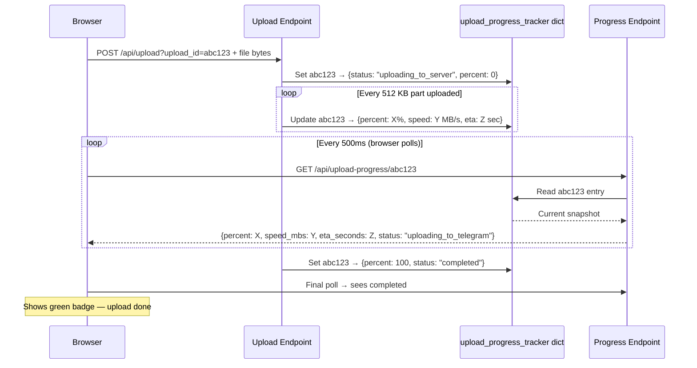
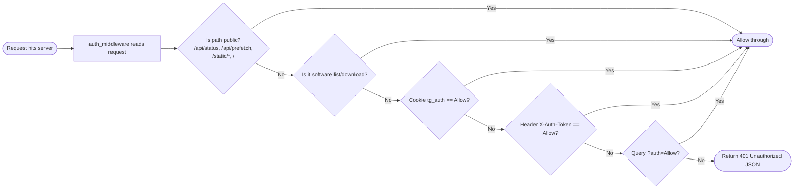

# SS Workspace — Data Processing & Flow Explained

---

## Overview

Every piece of data in SS Workspace goes through a journey: from your browser, through FastAPI, through Telegram's MTProto binary protocol, and into Telegram's data centers. On the way back (download), it streams from Telegram's DCs directly to your browser.

The local SQLite database is only a **lightweight index** — it stores names, sizes, and references (Telegram message IDs). The actual file bytes never live on the server permanently.

---

## 1. Data Lifecycle: File Upload



---

## 2. Data Lifecycle: File Download

```mermaid
sequenceDiagram
    participant BROWSER as Browser (User)
    participant FASTAPI as FastAPI Server
    participant SQLITE as SQLite Index
    participant TG_CLIENT as TelegramStorageClient
    participant TG_DC as Telegram Data Center

    BROWSER->>FASTAPI: GET /api/download/{uuid}
    FASTAPI->>SQLITE: SELECT * FROM files WHERE id = uuid
    SQLITE-->>FASTAPI: filename, telegram_message_id, channel_id, size

    FASTAPI->>TG_CLIENT: download_file_stream(message_id, filename, channel_id)
    TG_CLIENT->>TG_DC: get_messages(channel_entity, message_id)
    TG_DC-->>TG_CLIENT: Message object with media (document) attached
    TG_CLIENT->>TG_CLIENT: Extract doc_size, location, dc_id

    alt File > 10 MB (fast path)
        TG_CLIENT->>TG_CLIENT: fast_download_stream()<br/>Bounded asyncio.Queue (max 12 chunks)
        loop 6 workers in parallel
            TG_CLIENT->>TG_DC: GetFileRequest(location, offset=N×512KB, limit=512KB)
            TG_DC-->>TG_CLIENT: Bytes chunk at offset N
        end
        TG_CLIENT->>TG_CLIENT: asyncio.Condition ordering<br/>yield chunk[0], chunk[1], chunk[2]... in strict sequence
    else File ≤ 10 MB (simple path)
        TG_CLIENT->>TG_DC: iter_download(media, chunk_size=1MB)
        TG_DC-->>TG_CLIENT: Sequential 1 MB byte chunks
    end

    TG_CLIENT-->>FASTAPI: Async generator of byte chunks
    FASTAPI-->>BROWSER: StreamingResponse (HTTP chunked transfer)<br/>Content-Disposition: attachment; filename=...
    Note over BROWSER: Browser saves file to Downloads
```

---

## 3. Data Lifecycle: To-Do Tasks



---

## 4. Data Lifecycle: Text Notes



---

## 5. Channel Sync Data Flow

How existing Telegram channel files get discovered and indexed:



---

## 6. SQLite Data Model



---

## 7. In-Memory Upload Progress Tracking

The progress tracker is a simple Python dictionary kept in RAM inside `main.py`:



---

## 8. Authentication Data Flow



---

## 9. Demo Mode vs Live Mode

When `TELEGRAM_API_ID` or other credentials are missing, the app runs in **Demo Mode**:

| Operation | Live Mode | Demo Mode |
| :--- | :--- | :--- |
| File Upload | Sends bytes to Telegram Channel via MTProto | Copies file to `demo_storage/` folder locally |
| File Download | Fetches from Telegram Data Center | Reads from `demo_storage/` folder |
| Todo/Note send | Creates a real Telegram message | Increments a local counter, no message sent |
| Edit/Delete msg | Calls Telegram API | No-op (does nothing) |
| Sync | Scans real Telegram channels | Returns 0, skips |

This allows the app to function as a regular local file manager even without Telegram credentials.
