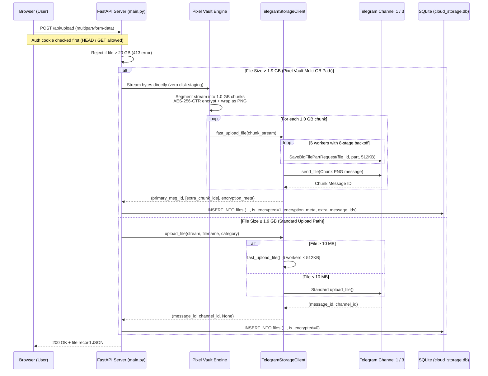
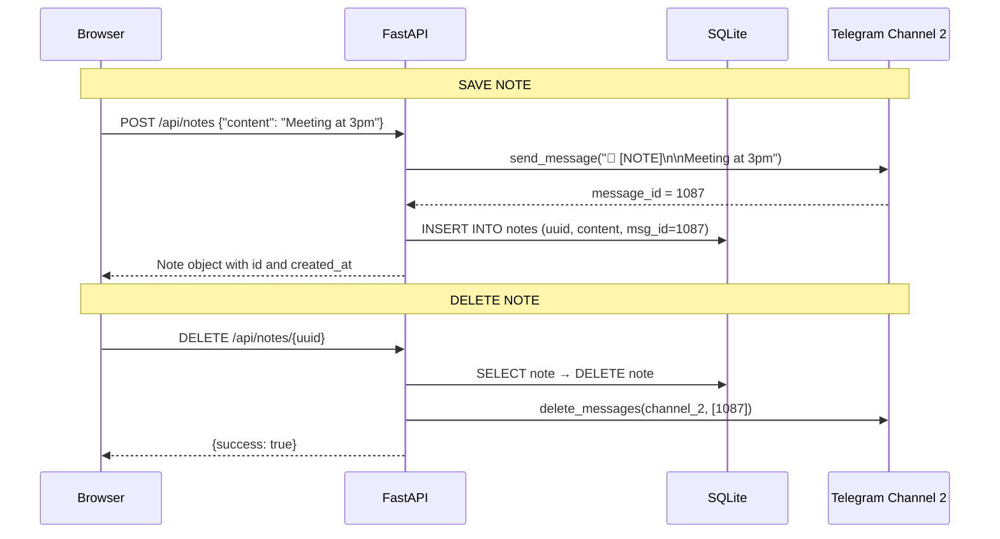
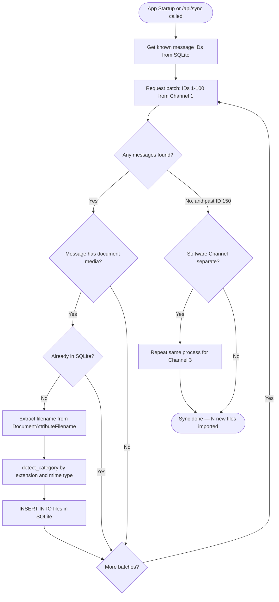
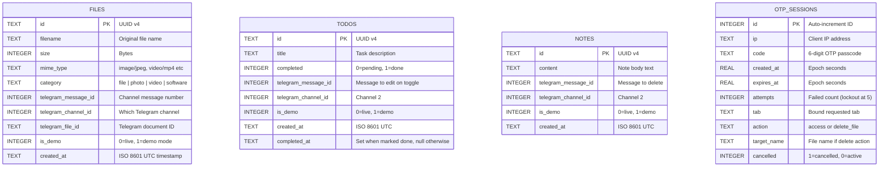
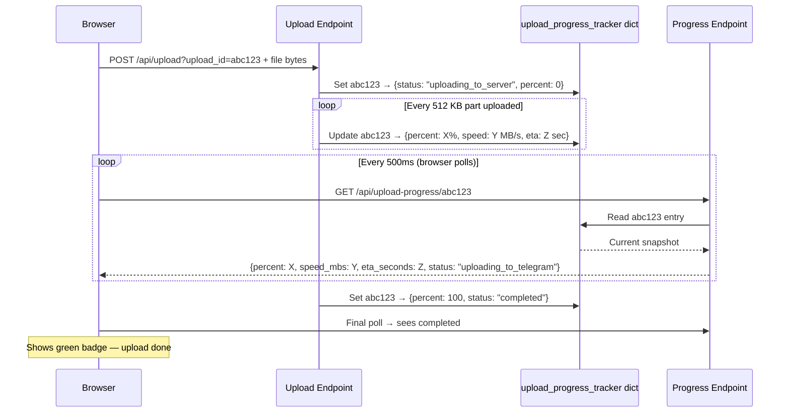
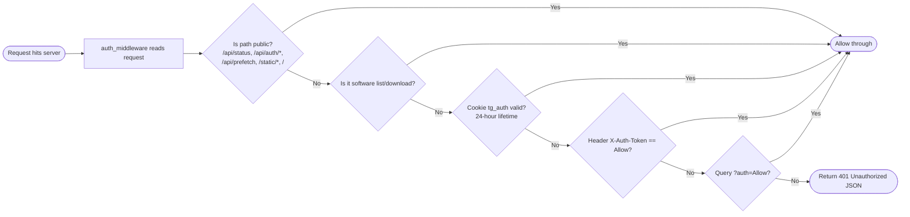

# SS Workspace — Data Processing & Flow Explained

---

## Overview

Every piece of data in SS Workspace goes through a journey: from your browser, through FastAPI, through Telegram's MTProto binary protocol, and into Telegram's data centers. On the way back (download), it streams from Telegram's DCs directly to your browser.

The local SQLite database is only a **lightweight index** — it stores names, sizes, and references (Telegram message IDs). The actual file bytes never live on the server permanently.

---

## 1. Data Lifecycle: File Upload (Standard & Multi-GB Pixel Vault)

```mermaid
sequenceDiagram
    participant BROWSER as Browser (User)
    participant FASTAPI as FastAPI Server (main.py)
    participant VAULT as Pixel Vault Engine
    participant TG_CLIENT as TelegramStorageClient
    participant TG_CHANNEL as Telegram Channel 1 / 3
    participant SQLITE as SQLite (cloud_storage.db)

    BROWSER->>FASTAPI: POST /api/upload (multipart/form-data)
    Note over BROWSER,FASTAPI: Auth cookie checked first (HEAD / GET allowed)
    FASTAPI->>FASTAPI: Reject if file > 20 GB (413 error)
    
    alt File Size > 1.9 GB (Pixel Vault Multi-GB Path)
        FASTAPI->>VAULT: Stream bytes directly (zero disk staging)
        VAULT->>VAULT: Segment stream into 1.0 GB chunks<br/>AES-256-CTR encrypt + wrap as PNG
        loop For each 1.0 GB chunk
            VAULT->>TG_CLIENT: fast_upload_file(chunk_stream)
            loop 6 workers with 8-stage backoff
                TG_CLIENT->>TG_CHANNEL: SaveBigFilePartRequest(file_id, part, 512KB)
            end
            TG_CLIENT->>TG_CHANNEL: send_file(Chunk PNG message)
            TG_CHANNEL-->>TG_CLIENT: Chunk Message ID
        end
        TG_CLIENT-->>FASTAPI: (primary_msg_id, [extra_chunk_ids], encryption_meta)
        FASTAPI->>SQLITE: INSERT INTO files (..., is_encrypted=1, encryption_meta, extra_message_ids)
    else File Size ≤ 1.9 GB (Standard Upload Path)
        FASTAPI->>TG_CLIENT: upload_file(stream, filename, category)
        alt File > 10 MB
            TG_CLIENT->>TG_CLIENT: fast_upload_file() [6 workers × 512KB]
        else File ≤ 10 MB
            TG_CLIENT->>TG_CHANNEL: Standard upload_file()
        end
        TG_CHANNEL-->>TG_CLIENT: (message_id, channel_id)
        TG_CLIENT-->>FASTAPI: (message_id, channel_id, None)
        FASTAPI->>SQLITE: INSERT INTO files (..., is_encrypted=0)
    end
    
    FASTAPI-->>BROWSER: 200 OK + file record JSON
```

---

## 2. Data Lifecycle: File Download (RFC 7233 Resumption & Decryption)

```mermaid
sequenceDiagram
    participant BROWSER as Browser / Downloader
    participant FASTAPI as FastAPI Server
    participant SQLITE as SQLite Index
    participant TG_CLIENT as TelegramStorageClient
    participant VAULT as Pixel Vault Decryptor
    participant TG_DC as Telegram Data Center

    BROWSER->>FASTAPI: GET / HEAD /api/download/{uuid} (Range: bytes=start-end)
    FASTAPI->>SQLITE: SELECT * FROM files WHERE id = uuid
    SQLITE-->>FASTAPI: Record metadata (size, is_encrypted, msg_id, extra_ids)

    alt HEAD Request
        FASTAPI-->>BROWSER: Instant 200 OK<br/>ETag, Accept-Ranges: bytes, Content-Length
    else Range Out of Bounds (start >= size)
        FASTAPI-->>BROWSER: HTTP 416 Range Not Satisfiable<br/>Content-Range: bytes */size
    else Valid GET / Range Request
        alt is_encrypted == 1 (Pixel Vault Stream)
            FASTAPI->>TG_CLIENT: download_pixel_vault_stream(file_record, start, length)
            TG_CLIENT->>VAULT: Initialize AES-256-CTR with chunk offset nonce
            loop Chunk Fetching with Lookahead Prefetch
                TG_CLIENT->>TG_DC: Fetch encrypted 1.0 GB PNG chunk parts
                TG_DC-->>TG_CLIENT: Ciphertext bytes
                VAULT->>VAULT: Strip PNG wrapper + on-the-fly AES decrypt
                VAULT-->>FASTAPI: Yield plaintext byte chunks
            end
        else is_encrypted == 0 (Plain Telegram Stream)
            FASTAPI->>TG_CLIENT: download_file_stream(message_id, channel_id)
            alt File > 10 MB
                TG_CLIENT->>TG_DC: fast_download_stream() (6 parallel workers)
            else File ≤ 10 MB
                TG_CLIENT->>TG_DC: iter_download() (1 MB chunks)
            end
            TG_DC-->>FASTAPI: Yield plaintext byte chunks
        end
        FASTAPI-->>BROWSER: HTTP 206 Partial Content (or 200 OK)<br/>Content-Range: bytes start-end/size<br/>ETag, Accept-Ranges, StreamingResponse
    end

---

## 3. Data Lifecycle: To-Do Tasks

```mermaid
sequenceDiagram
    participant BROWSER as Browser
    participant FASTAPI as FastAPI
    participant SQLITE as SQLite
    participant TG as Telegram Channel 2

    Note over BROWSER,TG: CREATE TASK
    BROWSER->>FASTAPI: POST /api/todos {"title": "Buy milk"}
    FASTAPI->>TG: send_message("⏳ [TODO] Buy milk")
    TG-->>FASTAPI: message_id = 1042
    FASTAPI->>SQLITE: INSERT INTO todos (uuid, "Buy milk", completed=0, msg_id=1042)
    FASTAPI-->>BROWSER: {id, title, completed: false, created_at}

    Note over BROWSER,TG: COMPLETE TASK
    BROWSER->>FASTAPI: PATCH /api/todos/{uuid} {"completed": true}
    FASTAPI->>SQLITE: UPDATE todos SET completed=1, completed_at=now WHERE id=uuid
    FASTAPI->>TG: edit_message(1042, "✅ [COMPLETED] ~Buy milk~")
    FASTAPI-->>BROWSER: Updated todo object

    Note over BROWSER,TG: DELETE TASK
    BROWSER->>FASTAPI: DELETE /api/todos/{uuid}
    FASTAPI->>TG: delete_messages(channel_2, [1042])
    FASTAPI->>SQLITE: DELETE FROM todos WHERE id=uuid
    FASTAPI-->>BROWSER: {success: true}
```

---

## 4. Data Lifecycle: Text Notes

```mermaid
sequenceDiagram
    participant BROWSER as Browser
    participant FASTAPI as FastAPI
    participant SQLITE as SQLite
    participant TG as Telegram Channel 2

    Note over BROWSER,TG: SAVE NOTE
    BROWSER->>FASTAPI: POST /api/notes {"content": "Meeting at 3pm"}
    FASTAPI->>TG: send_message("📝 [NOTE]\n\nMeeting at 3pm")
    TG-->>FASTAPI: message_id = 1087
    FASTAPI->>SQLITE: INSERT INTO notes (uuid, content, msg_id=1087)
    FASTAPI-->>BROWSER: Note object with id and created_at

    Note over BROWSER,TG: DELETE NOTE
    BROWSER->>FASTAPI: DELETE /api/notes/{uuid}
    FASTAPI->>SQLITE: SELECT note → DELETE note
    FASTAPI->>TG: delete_messages(channel_2, [1087])
    FASTAPI-->>BROWSER: {success: true}
```

---

## 5. Channel Sync Data Flow

How existing Telegram channel files get discovered and indexed:

```mermaid
flowchart TD
    A([App Startup or /api/sync called]) --> B[Get known message IDs from SQLite]
    B --> C[Request batch: IDs 1-100 from Channel 1]
    C --> D{Any messages found?}
    D -->|Yes| E{Message has document media?}
    E -->|Yes| F{Already in SQLite?}
    F -->|No| G[Extract filename from DocumentAttributeFilename]
    G --> H[detect_category by extension and mime type]
    H --> I[INSERT INTO files in SQLite]
    I --> J{More batches?}
    F -->|Yes| J
    E -->|No| J
    D -->|No, and past ID 150| K{Software Channel separate?}
    J -->|Yes| C
    K -->|Yes| L[Repeat same process for Channel 3]
    K -->|No| M([Sync done — N new files imported])
    L --> M
```

---

## 6. SQLite Data Model

```mermaid
erDiagram
    FILES {
        TEXT id PK "UUID v4"
        TEXT filename "Original file name"
        INTEGER size "Bytes"
        TEXT mime_type "image/jpeg, video/mp4 etc"
        TEXT category "file | photo | video | software"
        INTEGER telegram_message_id "Channel message number"
        INTEGER telegram_channel_id "Which Telegram channel"
        TEXT telegram_file_id "Telegram document ID"
        INTEGER is_demo "0=live, 1=demo mode"
        TEXT created_at "ISO 8601 UTC timestamp"
    }

    TODOS {
        TEXT id PK "UUID v4"
        TEXT title "Task description"
        INTEGER completed "0=pending, 1=done"
        INTEGER telegram_message_id "Message to edit on toggle"
        INTEGER telegram_channel_id "Channel 2"
        INTEGER is_demo "0=live, 1=demo"
        TEXT created_at "ISO 8601 UTC"
        TEXT completed_at "Set when marked done, null otherwise"
    }

    NOTES {
        TEXT id PK "UUID v4"
        TEXT content "Note body text"
        INTEGER telegram_message_id "Message to delete"
        INTEGER telegram_channel_id "Channel 2"
        INTEGER is_demo "0=live, 1=demo"
        TEXT created_at "ISO 8601 UTC"
    }

    OTP_SESSIONS {
        INTEGER id PK "Auto-increment ID"
        TEXT ip "Client IP address"
        TEXT code "6-digit OTP passcode"
        REAL created_at "Epoch seconds"
        REAL expires_at "Epoch seconds"
        INTEGER attempts "Failed count (lockout at 5)"
        TEXT tab "Bound requested tab"
        TEXT action "access or delete_file"
        TEXT target_name "File name if delete action"
        INTEGER cancelled "1=cancelled, 0=active"
    }
```

---

## 7. In-Memory Upload Progress Tracking

The progress tracker is a simple Python dictionary kept in RAM inside `main.py`:

```mermaid
sequenceDiagram
    participant FRONTEND as Browser
    participant UPLOAD as Upload Endpoint
    participant TRACKER as upload_progress_tracker dict
    participant POLL as Progress Endpoint

    FRONTEND->>UPLOAD: POST /api/upload?upload_id=abc123 + file bytes
    UPLOAD->>TRACKER: Set abc123 → {status: "uploading_to_server", percent: 0}
    
    loop Every 512 KB part uploaded
        UPLOAD->>TRACKER: Update abc123 → {percent: X%, speed: Y MB/s, eta: Z sec}
    end
    
    loop Every 500ms (browser polls)
        FRONTEND->>POLL: GET /api/upload-progress/abc123
        POLL->>TRACKER: Read abc123 entry
        TRACKER-->>POLL: Current snapshot
        POLL-->>FRONTEND: {percent: X, speed_mbs: Y, eta_seconds: Z, status: "uploading_to_telegram"}
    end
    
    UPLOAD->>TRACKER: Set abc123 → {percent: 100, status: "completed"}
    FRONTEND->>POLL: Final poll → sees completed
    Note over FRONTEND: Shows green badge — upload done
```

---

## 8. Authentication Data Flow

```mermaid
flowchart LR
    A([Request hits server]) --> B[auth_middleware reads request]
    B --> C{Is path public?\n/api/status, /api/auth/*,\n/api/prefetch, /static/*, /}
    C -->|Yes| PASS([Allow through])
    C -->|No| D{Is it software list/download?}
    D -->|Yes| PASS
    D -->|No| E{Cookie tg_auth valid?\n24-hour lifetime}
    E -->|Yes| PASS
    E -->|No| F{Header X-Auth-Token == Allow?}
    F -->|Yes| PASS
    F -->|No| G{Query ?auth=Allow?}
    G -->|Yes| PASS
    G -->|No| BLOCK([Return 401 Unauthorized JSON])
```

---

## 9. Demo Mode vs Live Mode

When `TELEGRAM_API_ID` or other credentials are missing, the app runs in **Demo Mode**:

| Operation | Live Mode | Demo Mode |
| :--- | :--- | :--- |
| File Upload | Sends bytes to Telegram Channel via MTProto | Copies file to `demo_storage/` folder locally |
| File Download | Fetches from Telegram Data Center | Reads from `demo_storage/` folder |
| Todo/Note send | Creates a real Telegram message | Increments a local counter, no message sent |
| Edit/Delete msg | Calls Telegram API | No-op (does nothing) |
| Sync | Scans real Telegram channels | Returns 0, skips |

This allows the app to function as a regular local file manager even without Telegram credentials.
